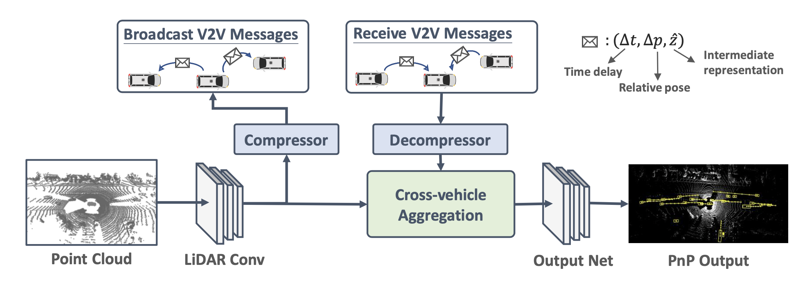
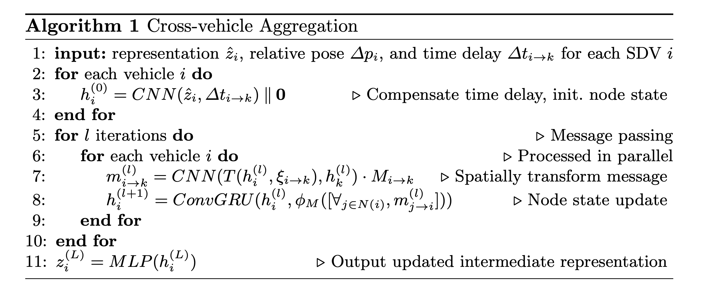

# V2VNet: Vehicle-to-Vehicle Communication for Cooperative Perception
#### V2VNet: An Efficient Message-Passing Approach for V2V Cooperative Perception
##### Published as a conference paper at CVPR 2020
##### L. Li∗, W. Wang∗, A. Lin*, H. Chen**
##### ∗ University of California, Berkeley   ** University of Toronto

---

## Problem

The research addresses the challenge of **cooperative perception among connected autonomous vehicles (AVs)**. Traditional single-agent perception is limited by occlusion, sensing range, and viewpoint. While AVs can communicate via V2V channels, efficiently fusing information from multiple vehicles in real time remains challenging, especially under bandwidth constraints and asynchronous sensor data.

---

## Importance

Reliable **V2V cooperative perception** can significantly improve **safety and situational awareness** for autonomous driving. By sharing sensed information among vehicles, AVs can detect occluded objects, anticipate hazards, and make safer decisions. This study highlights the importance of **low-latency message passing** and **feature-level fusion**, paving the way for practical cooperative autonomous driving systems.

---

## Insights

The study found that:

- Sharing intermediate features between vehicles provides better perception than sharing raw LiDAR data or bounding boxes alone.  
- Cooperative perception mitigates occlusion issues and extends sensing range.  
- Asynchronous communication and bandwidth constraints affect performance, necessitating careful design of feature compression and aggregation.  
- Message passing enables vehicles to weigh contributions from neighbors dynamically, improving detection accuracy without overwhelming network resources.

---

## Mechanism

V2VNet uses a **graph-based message passing framework**:

1. Each vehicle is a node; edges represent V2V communication channels.  
2. Each vehicle extracts intermediate features from its LiDAR point clouds.  
3. Vehicles exchange messages (feature maps) with neighbors.  
4. A **neural network aggregates the received features**, applying learned weights to each neighbor, producing refined features for detection.  
5. The process supports **real-time operation** with low communication bandwidth via feature compression.

---

## Results
- V2VNet significantly outperforms **single-agent perception**, improving AP@0.5 by up to 15%.  
- Performance remains robust under moderate communication delays (~100ms) and bandwidth constraints.  
- The message-passing scheme enables vehicles to handle **occluded objects**, improving detection coverage in dense traffic scenarios.  
- Ablation studies show that **intermediate feature fusion** outperforms early fusion (raw data) and late fusion (bounding boxes).  
- Feature compression and attention weighting are critical for balancing **network bandwidth and detection performance**.  
