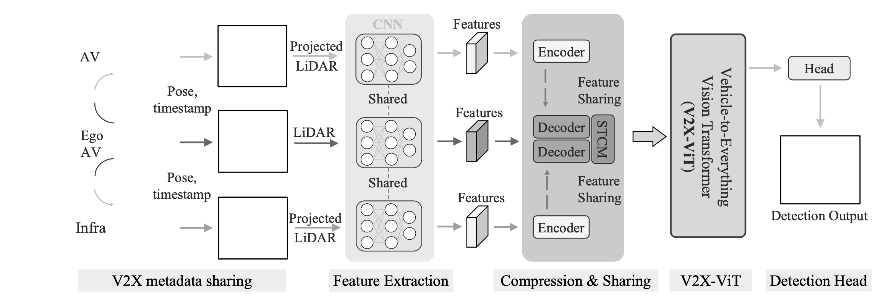
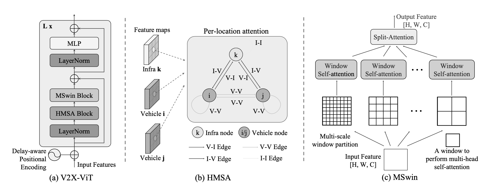
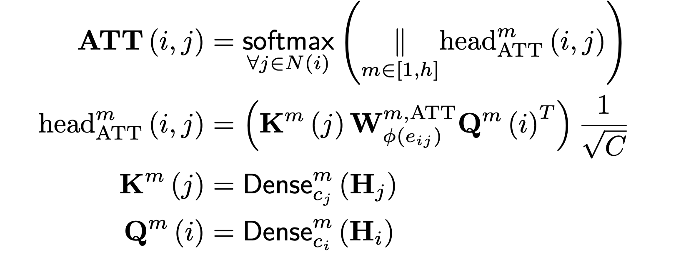
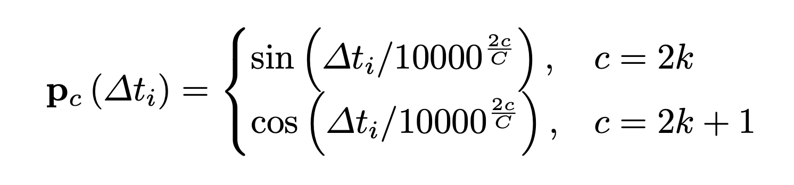

# V2X-ViT: Vehicle-to-Everything Perception with Vision Transformer

#### V2X-ViT: Attention-based Cooperative Perception for Connected Vehicles  
##### Published as a conference paper  
##### Runsheng Xu¹?, Hao Xiang¹?, Zhengzhong Tu²?, Xin Xia¹, Ming-Hsuan Yang³,⁴, and Jiaqi Ma¹†  
¹ University of California, Los Angeles  
² University of Texas at Austin  
³ Google Research  
⁴ University of California, Merced  

## Problem

This research addresses the challenge of **cooperative perception** in connected autonomous vehicles (AVs) and infrastructure. Single-agent perception is limited by occlusion, viewpoint, and sensor range. Sharing information between AVs and infrastructure can improve detection, but fusing multi-agent LiDAR data effectively under asynchronous communication and bandwidth constraints is non-trivial.

## Importance

Reliable V2X cooperative perception enables AVs to:

- Detect occluded or far-away objects  
- Improve safety and situational awareness  
- Make informed driving decisions in dense environments  

This requires **attention-aware fusion** and handling **temporal delays** and **heterogeneous sensors**.

## Insights

- Not all agents contribute equally; infrastructure often sees occluded regions better than vehicles.  
- Attention maps show that V2X-ViT prioritizes informative agents dynamically.  
- Multi-scale spatial attention (MSwin) enhances robustness against localization errors.  
- Delay-aware positional encoding (DPE) allows the model to compensate for asynchronous message arrival.

## Mechanism

V2X-ViT consists of several stages:

1. **V2X Metadata Sharing**: Each agent shares pose and timestamp with the ego vehicle.  
2. **Feature Extraction**: LiDAR data is projected and fed into a shared CNN backbone to extract features.

3. **Compression & Sharing**: Features are optionally compressed, then shared with other agents.  
4. **V2X-ViT (Transformer)**:  
   - **HMSA**: Heterogeneous Multi-agent Self-Attention models the interactions between vehicles and infrastructure.  
   - **MSwin**: Multi-Scale Window attention captures local and global spatial relationships.  
   - **DPE**: Delay-aware positional encoding compensates for time misalignment.  

5. **Detection Head**: Aggregated features are used to predict 3D bounding boxes for vehicles.

## Formulas (Optional Figures)

### HMSA Attention Formulation

### Delay-aware Positional Encoding (DPE)

## Results

- V2X-ViT outperforms single-agent baselines and previous intermediate fusion methods.  
- The model maintains high performance under noisy settings (pose error and delay).  
- Attention maps demonstrate that the model focuses on informative agents, e.g., infrastructure in occluded regions.  
- MSwin improves robustness against localization errors, and DPE handles asynchronous message propagation effectively.

## Key Takeaways

- **HMSA**: Models inter-agent relationships based on type (Vehicle/Infrastructure).  
- **MSwin**: Provides multi-scale intra-agent spatial reasoning.  
- **DPE**: Handles temporal misalignment.  
- **Feature Fusion**: Adaptive attention allows the model to weigh agents by importance.  

V2X-ViT sets a foundation for **future multi-sensor cooperative perception**, extending beyond LiDAR and vehicle detection tasks.
