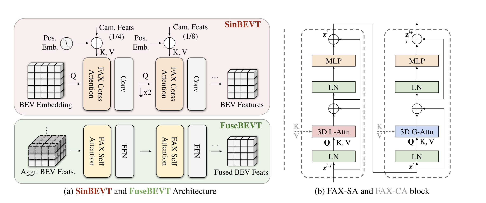
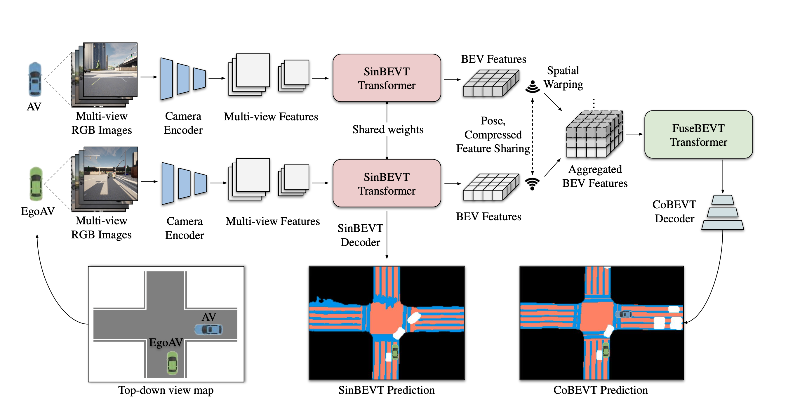

# CoBEVT: Cooperative Bird’s Eye View Semantic Segmentation with Sparse Transformers

Runsheng Xu1⇤, Zhengzhong Tu2⇤, Hao Xiang1, Wei Shao3, Bolei Zhou1, Jiaqi Ma1†  
1 University of California, Los Angeles  
2 University of Texas at Austin  
3 University of California, Davis  

## Problem

The research addresses the problem of **Bird’s-Eye-View (BEV) semantic segmentation in both single-agent and multi-agent cooperative autonomous driving settings**. Camera-based perception suffers from inherent limitations such as lack of explicit depth information, occlusion, and limited field of view. In multi-agent scenarios, additional challenges arise from cross-view alignment, communication constraints, and partial observations across vehicles, making robust BEV understanding difficult.

## Importance

Accurate BEV perception is critical for safe autonomous driving and global scene understanding, as it provides a unified top-down representation of the environment. Cooperative perception further enhances this capability by allowing multiple autonomous vehicles to share complementary observations, improving robustness against occlusions and sensor limitations. This is especially important for real-world deployment where single-agent perception is often insufficient for reliable decision-making.

## Insights

The study found that:

- BEV representation can be learned directly from multi-view camera images without explicit 3D reconstruction or depth supervision.  
- Implicit learning via attention mechanisms is effective for mapping image features to BEV space.  
- The proposed Fused Axial Attention (FAX) module enables both local spatial correspondence and global contextual reasoning.  
- Sharing BEV features across agents significantly improves robustness in occluded and complex traffic scenes.  
- A unified transformer design can handle both image-to-BEV transformation and multi-agent BEV fusion.

## Mechanism

CoBEVT operates in a two-stage pipeline:

### 1. Single-Agent BEV Generation
Each vehicle extracts features from multi-view camera images using a CNN backbone (e.g., ResNet or EfficientNet). These features are then projected into a BEV representation using the FAX self-attention module, which learns an implicit correspondence between image space and BEV space.

### 2. Multi-Agent BEV Fusion
Each agent broadcasts its BEV representation to nearby vehicles within a communication range. The ego vehicle aggregates received BEV features by stacking them into a unified tensor. A second FAX-based Transformer encoder performs multi-agent fusion, producing a consistent canonical BEV map.

## Results

CoBEVT achieves state-of-the-art performance on multi-view cooperative BEV semantic segmentation benchmarks, including OPV2V and nuScenes. The method outperforms CVT, LSS, and BEVFormer.

Improvements are particularly strong in:
- Vehicle detection  
- Lane structure understanding  
- Drivable area segmentation  

Performance gains are more significant in occluded and complex urban scenarios due to multi-agent cooperation.

## Limitations

- Mainly evaluated on simulated cooperative datasets  
- Real-world V2V issues (latency, packet loss, bandwidth limits) are not explicitly modeled  
- Assumes accurate and synchronized pose information  
- Performance degrades under adverse weather and low-light conditions  
- Cross-domain generalization remains an open challenge  

## Summary

CoBEVT is a Transformer-based cooperative BEV perception framework that replaces explicit geometric projection with learned attention-based mapping. It introduces Fused Axial Attention (FAX) to efficiently model both local and global interactions across views and agents, enabling strong performance in both single-agent and multi-agent autonomous driving scenarios.
