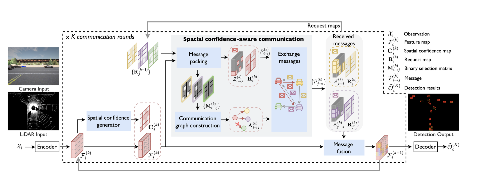

# Where2comm: Communication-Efficient Collaborative Perception via Spatial Confidence Maps

#### Where2comm: Spatial Confidence-Aware Message Passing for Efficient V2X Perception  
##### Yue Hu, Shaoheng Fang, Zixing Lei, Yiqi Zhong, Siheng Chen  
##### Shanghai Jiao Tong University / University of Southern California  

## Problem

This work addresses **communication-efficient collaborative 3D object detection in multi-agent autonomous driving systems**, where agents must share perception information under strict bandwidth constraints.

Single-agent perception suffers from limitations such as **occlusion**, **limited field of view**, and **incomplete environmental understanding**, which reduce robustness in complex driving scenarios.

In multi-agent settings, although collaboration improves perception quality, it introduces challenges including **limited communication bandwidth**, **feature misalignment across agents**, and **inefficient information sharing**, making scalable deployment difficult.

## Importance

Collaborative perception enables multiple agents to share complementary observations, significantly improving scene understanding compared to single-agent perception.

It is particularly important for:
- Occlusion handling in urban environments  
- Long-range object detection  
- Robust perception under adverse weather and noise  
- Safety-critical autonomous driving decisions  

However, these benefits depend on **efficient and adaptive communication strategies**.

## Insights

- Spatial regions have unequal importance for perception tasks  
- Detection confidence can serve as a proxy for perceptual importance  
- Communication should be sparse rather than fully broadcast  
- Agent interaction should be based on **need–supply matching**  
- Fusion should be spatially aware, not only agent-level  

## Mechanism

Where2comm consists of five main components:

### 1. Feature Encoding
Each agent extracts spatial features from camera or LiDAR inputs using a shared encoder.

### 2. Spatial Confidence Generation
A detection-decoder-based module generates a **spatial confidence map** that reflects perceptual importance.

### 3. Message Packing
Only high-confidence regions are selected to form **sparse feature messages**.

Each message contains:
- Sparse feature map  
- Request map (missing/uncertain regions)

### 4. Sparse Communication Graph
A dynamic graph is constructed based on **need–supply similarity**, activating communication only between complementary agents.

### 5. Spatial Confidence-Aware Fusion
A Transformer-based fusion module aggregates messages using:
- Sparse features  
- Spatial confidence maps  
- Sensor positional (extrinsic) encoding  

## Output

- 3D bounding boxes  
- Class confidence  
- Object geometry (x, y, w, h, orientation)  

## Results

Where2comm achieves strong performance on cooperative perception benchmarks while significantly reducing communication cost.

Key improvements:
- Robustness under occlusion  
- Efficient bandwidth usage  
- Better multi-agent fusion  
- Improved scalability  

## Key Takeaways

- Confidence-guided selective communication  
- Sparse message transmission  
- Need–supply based communication graph  
- Transformer-based spatial fusion  
- Trade-off between accuracy and bandwidth efficiency  

-

## Summary

Where2comm introduces a spatial confidence-driven communication framework for multi-agent perception. It enables efficient and scalable collaborative 3D object detection by transmitting only perceptually important regions and fusing them using geometry-aware attention.
